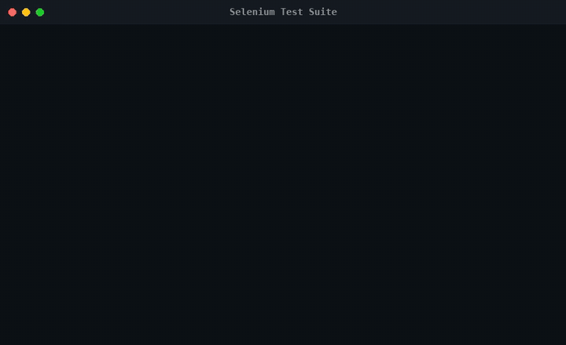
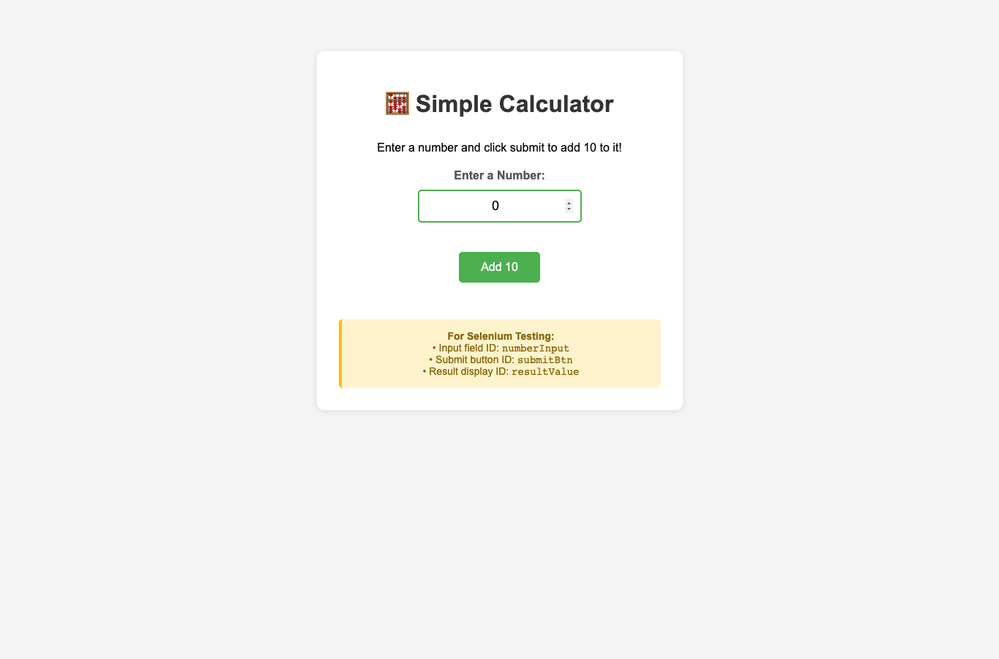
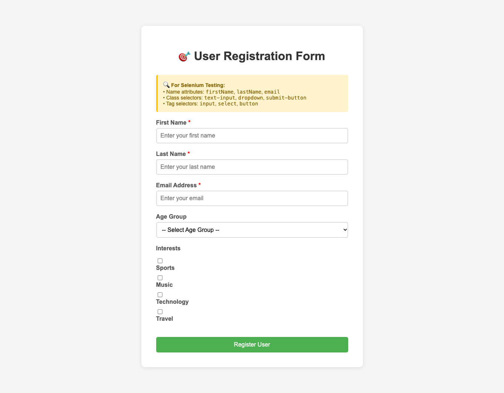
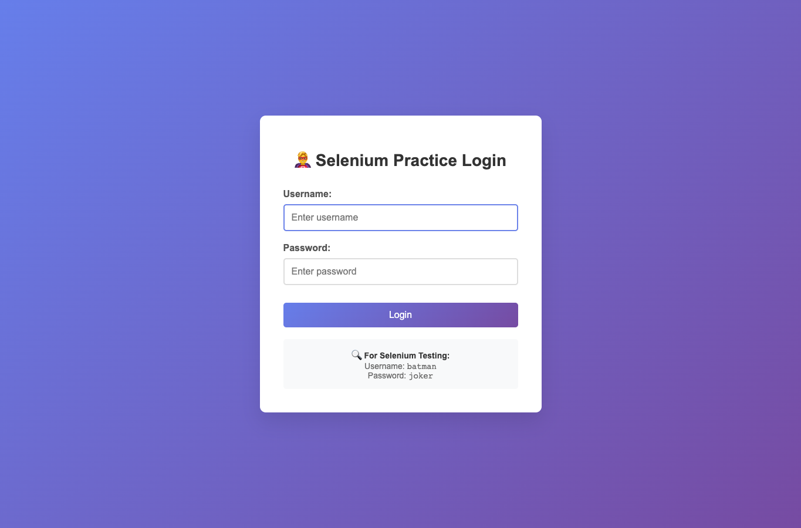

<h1 align="center">Selenium Test Suite</h1>

<p align="center">
  Browser automation in Java: Selenium WebDriver drives Firefox through local pages while JUnit 5 checks the results.
</p>

<p align="center">
  <a href="#features">Features</a> ·
  <a href="#quick-start">Quick start</a> ·
  <a href="#how-it-works">How it works</a> ·
  <a href="#project-notes">Project notes</a>
</p>

<p align="center">
  
  
  
</p>

<p align="center">
  
</p>

This repository collects browser automation exercises and local HTML fixtures. It was created for CSC3510 coursework and demonstrates how Selenium can interact with forms and page controls while JUnit checks the results.

## Features

### Calculator tests

- **Check calculator behavior.** Parameterized cases enter values, click Add 10, and compare the displayed result.

<p align="center"></p>

### Form tests

- **Exercise registration flows.** The signup fixture includes required fields, an age dropdown, interest checkboxes, and success and error feedback.

<p align="center"></p>

### Login practice

- **Check login states.** The local login page handles valid and invalid credentials and switches between login and welcome views.

<p align="center"></p>

## Quick start

Prerequisites on macOS: JDK, Maven, Firefox, and Homebrew. This repository has no checked-in Maven or Gradle build file. Several classes hard-code Windows GeckoDriver paths that must be changed for macOS before running those classes.

The following setup uses Maven to resolve Selenium and JUnit, the standalone JUnit console launcher, and the calculator parameterized test:

```bash
git clone https://github.com/cl0ax/SeleniumAgain.git
cd SeleniumAgain
brew install geckodriver
mkdir -p /tmp/seleniumagain/src /tmp/seleniumagain/classes
cp Tests/InlineParameterizedCalculatorTest.java /tmp/seleniumagain/src/
cp simpleCaculator.html /tmp/seleniumagain/
sed -i '' 's#C:\\\\Resources\\\\FireFoxDriver\\\\geckodriver.exe#/opt/homebrew/bin/geckodriver#' /tmp/seleniumagain/src/InlineParameterizedCalculatorTest.java
```

Create `/tmp/seleniumagain/pom.xml` with these dependencies, then resolve the test classpath:

```xml
<project xmlns="http://maven.apache.org/POM/4.0.0">
  <modelVersion>4.0.0</modelVersion>
  <groupId>local.demo</groupId><artifactId>seleniumagain</artifactId><version>1.0</version>
  <dependencies>
    <dependency><groupId>org.seleniumhq.selenium</groupId><artifactId>selenium-java</artifactId><version>4.25.0</version></dependency>
    <dependency><groupId>org.junit.jupiter</groupId><artifactId>junit-jupiter</artifactId><version>5.11.3</version></dependency>
  </dependencies>
</project>
```

```bash
mvn -f /tmp/seleniumagain/pom.xml dependency:build-classpath -Dmdep.outputFile=/tmp/seleniumagain/classpath.txt
curl -fL -o /tmp/seleniumagain/junit-platform-console-standalone-1.11.3.jar https://repo.maven.apache.org/maven2/org/junit/platform/junit-platform-console-standalone/1.11.3/junit-platform-console-standalone-1.11.3.jar
cd /tmp/seleniumagain
javac -cp "$(cat classpath.txt)" -d classes src/InlineParameterizedCalculatorTest.java
MOZ_HEADLESS=1 java -jar junit-platform-console-standalone-1.11.3.jar execute --class-path "classes:.:$(cat classpath.txt)" --select-class InlineParameterizedCalculatorTest --details tree
```

`MOZ_HEADLESS=1` is optional and keeps Firefox from opening a visible window. The test source uses the copied `simpleCaculator.html` fixture from the current working directory.

## How it works

`Tests/` contains JUnit examples and parameterized tests. The test setup creates a `FirefoxDriver`, loads a local `file://` fixture, exercises elements through Selenium, and checks the resulting page state with JUnit assertions. Root-level HTML files provide the calculator, signup, login, and other practice pages; `src/` contains standalone exercises.

## Project notes

This is CSC3510 coursework and a collection of practice programs, not a production test framework. The repository has no checked-in dependency/build configuration, so Selenium and JUnit versions must be supplied when compiling. Several classes hard-code Windows GeckoDriver paths, and some others expect a repository-local driver or a particular Firefox installation path. Update the relevant path for your machine before running those classes.

## License

Distributed under the MIT License. See `LICENSE`.
